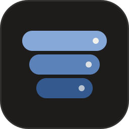
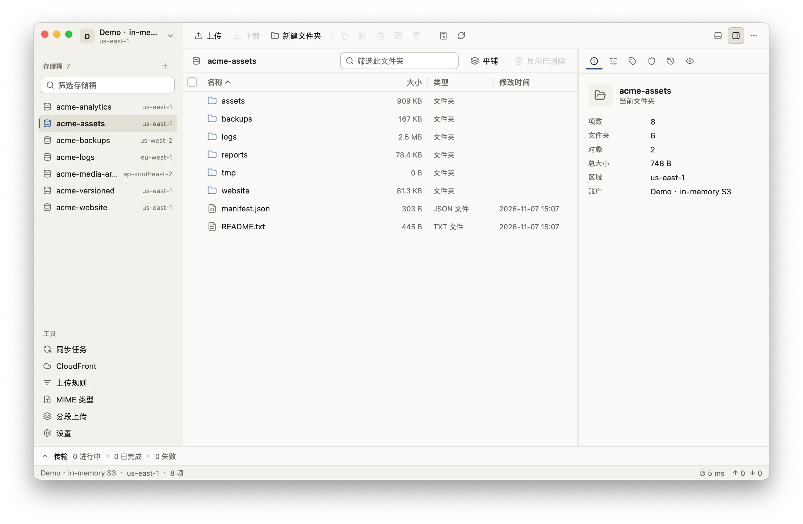

<p align="center">
  
</p>

<h1 align="center">Pail</h1>

<p align="center">
  Amazon S3、Cloudflare R2、MinIO 等 S3 兼容存储的桌面客户端。<br>
  支持 Windows、macOS 和 Linux，免费开源。
</p>

<p align="center">
  <a href="https://pail.download/zh/">网站</a> ·
  <a href="https://github.com/DejavuMoe/Pail/releases/latest">下载</a> ·
  <a href="https://pail.download/zh/docs/">文档</a> ·
  <a href="README.md">English</a>
</p>

<p align="center">
  <a href="https://awesomemygo.dev/apps/pail"></a>
</p>

<picture>
  <source media="(prefers-color-scheme: dark)" srcset="docs/images/main-dark-zh.webp">
  
</picture>

## 功能

- **账户**：访问密钥、AWS 配置文件、默认凭据链、AssumeRole 或匿名访问。其他服务可设置自定义端点、区域和路径风格寻址，并先测试连接。没有列出存储桶权限的密钥可以指定存储桶和可用的文件夹。一个代理（HTTP、HTTPS 或 SOCKS5）对所有账户生效。
- **浏览**：可排序、可多选的对象表格，自动分页，带面包屑、筛选、平铺视图和检查器。预览文本、图片和十六进制，复制对象键、URI 和预签名链接，按需计算文件夹大小。
- **传输**：上传、下载文件、文件夹、指定版本或整个存储桶，也可以把文件拖进窗口。上传和下载分开排队，显示进度和速度，可取消和重试。目标已存在时有五种处理方式。大文件分段上传并带校验和；下载校验通过后才替换目标文件。
- **对象属性**：为单个或多个对象修改请求头、元数据、标签、ACL、存储类别和服务端加密（SSE-S3、SSE-KMS、SSE-C）。
- **版本**：列出版本和删除标记，下载或恢复旧版本，恢复已删除的对象键，只永久删除你选中的版本。
- **存储桶**：创建、清空、删除，复制或移动内容。用表单或 JSON 编辑 14 项存储桶设置。列出并中止未完成的分段上传。可以给存储桶设置别名。
- **同步任务**：上传、下载或镜像文件夹。可按大小和时间、仅大小或校验和比较，按通配符排除文件，执行前先查看计划。
- **上传规则**：按存储桶和对象键匹配，设置请求头、存储类别和加密，或用 GZIP、ZIP、AES-256 ZIP 压缩。
- **链接**：带有效期的 GET 和 PUT 预签名链接，可指定版本，也可批量生成。每个账户可设置 CDN 域名。AWS 账户可提交 CloudFront 失效请求。
- **界面**：命令面板（`Ctrl+K`，macOS 上是 `⌘K`）、键盘快捷键，英文和简体中文，浅色和深色主题。

## 安装

从 [最新版本](https://github.com/DejavuMoe/Pail/releases/latest) 下载对应系统的压缩包。镜像 [pan.zsh.moe/Pail](https://pan.zsh.moe/Pail/) 上有相同的文件。

- **Windows**：`Pail-v<version>-windows-amd64.zip`（x64）或 `Pail-v<version>-windows-arm64.zip`（Arm）
- **macOS 11 及以上**：`Pail-v<version>-darwin-arm64.zip`（Apple 芯片）或 `Pail-v<version>-darwin-amd64.zip`（Intel）
- **Linux**：`Pail-v<version>-linux-amd64.tar.gz`（x64）或 `Pail-v<version>-linux-arm64.tar.gz`（Arm）

每个压缩包都含桌面应用和命令行工具 `pail`。macOS 是 `Pail.app`；Linux 还带 `.desktop` 文件和图标。不提供 32 位版本。

可执行文件名带版本号和平台。本文把它们叫作 `pail-desktop` 和 `pail`，请重命名文件或创建别名。

### 校验下载

计算压缩包的 SHA-256，与同一版本 `SHA256SUMS` 中对应的那一行比较：

```sh
sha256sum Pail-v0.5.3-linux-amd64.tar.gz           # Linux
shasum -a 256 Pail-v0.5.3-darwin-arm64.zip         # macOS
Get-FileHash Pail-v0.5.3-windows-amd64.zip         # Windows PowerShell
```

### 在 macOS 上首次打开

应用没有签名和公证，macOS 会拒绝打开下载的副本。解压后把 `Pail.app` 移到"应用程序"，然后清除一次隔离标记：

```sh
xattr -dr com.apple.quarantine /Applications/Pail.app
```

### 在 Windows 上首次打开

可执行文件没有签名。如果 SmartScreen 提示"Windows 已保护你的电脑"，点击**更多信息**，再点击**仍要运行**。

## 快速开始

1. 启动 `pail-desktop`，打开侧栏顶部的账户菜单，添加账户。自建或第三方服务需要填写：
   - 端点，例如 `https://s3.example.com`，以及区域，例如 `us-east-1`；
   - 访问密钥 ID 和私有访问密钥；
   - **路径风格寻址**：MinIO 和大多数自建网关需要打开，AWS 保持关闭；
   - 可选的 **CDN URL**，例如 `https://cdn.example.com`。

   点击**测试连接**，然后保存。私有访问密钥会存进系统钥匙串。
2. 在侧栏选择存储桶。把文件拖进窗口即可上传；选中对象后点击**下载**保存到本地。

`pail-desktop` 还支持这些参数：

| 参数 | 作用 |
| --- | --- |
| `--config-dir` | 使用其他配置目录。 |
| `--theme` | `system`、`light` 或 `dark`。 |
| `--size` | 初始窗口大小，例如 `1280x800`。 |
| `--tool` | 启动时打开工具：`sync`、`cloudfront`、`rules`、`mime`、`multipart` 或 `settings`。 |
| `--version` | 输出版本号后退出。 |

## 命令行

`pail` 使用桌面应用的账户、已保存的同步任务和设置。可以用 `pail account add` 添加账户，它会以不回显的方式询问私有访问密钥；也可以在桌面应用里添加。

```sh
pail account add backup --endpoint https://s3.example.com --region us-east-1 --path-style --access-key-id AKIAEXAMPLE
pail accounts
pail ls s3://my-bucket/photos/ -r
pail cp ./dist s3://my-bucket/site/ -r --conflict newer
pail sync ./photos s3://my-bucket/photos/ --dry-run
pail presign s3://my-bucket/report.pdf --expires 1h
pail cat s3://my-bucket/notes.txt
```

全部命令、参数、JSON 输出和退出码见 [命令行参考](docs/cli.zh-CN.md)。

## 数据与隐私

- **配置**保存在用户配置目录下的 `Pail` 文件夹（`%AppData%\Pail`、`~/Library/Application Support/Pail` 或 `~/.config/Pail`），也可以用 `--config-dir` 指定。里面有设置、账户、同步任务、上传规则和已保存机密的名称。
- **机密**（私有访问密钥、会话令牌、代理密码）存进系统钥匙串，服务名为 `Pail`。没有钥匙串时，可以在**设置 › 安全**里改用加密保险库。
- **日志**默认关闭。开启后，`logs/pail.log` 不含 URL 查询参数、Authorization 请求头、签名和已知的机密值。手动输入的密码只能按标签识别，分享日志前请先检查。
- **网络**：Pail 只连接你账户的端点，经由**设置 › 网络**里的代理或 `HTTP_PROXY`、`HTTPS_PROXY`。没有遥测，也不检查更新。

## 已测试的平台与服务

- 桌面应用：Windows、Linux 和 macOS（Apple 芯片与 Intel）。
- 服务：Amazon S3、Cloudflare R2、Wasabi、MinIO 和 VersityGW。
- AssumeRole 凭据和 CloudFront 还没有在真实 AWS 账户上试过。

已知限制见 [更新日志](CHANGELOG.zh-CN.md)。

## 从源码构建

需要 Go 1.27.3，不需要 C 编译器。

```sh
go build -o build/ ./cmd/pail-desktop ./cmd/pail
```

测试、发布打包和项目结构见 [CONTRIBUTING.md](CONTRIBUTING.md)（英文）。

## 许可证

Pail 以 [MIT 许可证](LICENSE) 发布，随附 [Lucide](https://lucide.dev) 图标（ISC 许可证）和 Inter 字体（SIL Open Font License 1.1）。

Amazon S3 是 Amazon.com, Inc. 的商标。Pail 与 AWS 没有关联，也未获其认可或赞助。
